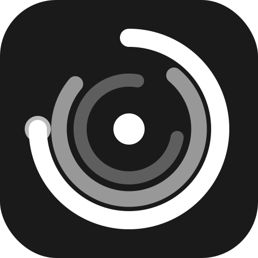

<p align="center">
  
</p>

<h1 align="center">Orbit</h1>

<p align="center">
  A macOS desktop app that pairs every view — code editor, browser, terminal, PDF reader, notepad — with its own AI console powered by Claude.
</p>

---

## What it does

Orbit is a multi-view container where each view comes with a resizable AI chat panel on the right. Claude can see what's in the view and use context-specific tools to act on it:

| View | What Claude can do |
|---|---|
| **Code** | Read, write, and search files inside the workspace folder |
| **Browser** | Navigate pages, click elements, fill inputs, extract page text |
| **Terminal** | Run shell commands and read the output |
| **Document** | Read and reference PDF content |
| **Notepad** | Read, write, and append to the note |

All views share the same model selection (Opus 4.8, Sonnet 4.6, Haiku 4.5) and maintain their own independent chat history, persisted across restarts.

## Getting started

**Prerequisites:** macOS, Node.js 20+, an [Anthropic API key](https://console.anthropic.com/)

```bash
npm install
npm run dev
```

The app opens with an empty sidebar. Click **+**, choose a view type, and pick a folder or URL. Enter your API key via the settings icon before sending the first message.

> [!NOTE]
> `npm install` runs `electron-rebuild` automatically to compile the native `node-pty` module for your local Electron version. If you upgrade Electron, run `npm run postinstall` again.

## Architecture

```
src/                            # Renderer (React + TypeScript)
├── App.tsx                     # Root — hydrates state, mounts shell
├── shell/                      # Sidebar, MainPane, ChatPanel, modals
├── views/
│   ├── registry.ts             # registerView / listViewTypes / getViewType
│   ├── types.ts                # ViewTypeDefinition, AiTool interfaces
│   ├── code/                   # Monaco editor + file tools
│   ├── browser/                # Embedded browser + navigation tools
│   ├── terminal/               # xterm.js + shell execution tools
│   ├── pdf/                    # pdfjs document viewer
│   └── notepad/                # Rich-text notepad + edit tools
├── state/                      # Zustand store, schema migrations
├── ipc/client.ts               # Typed wrapper around window.api
└── lib/                        # uid, markdown, url, lang utilities

electron/                       # Main process (Node.js)
├── main.ts                     # Window creation, IPC registration, quit flush
├── preload.ts                  # contextBridge → window.api
└── ipc/                        # fs, dialog, store, ai, terminal, memory handlers
```

State is debounced (200 ms) into `electron-store` and flushed synchronously on quit. Schema is versioned; on version bumps the app falls back to defaults rather than crashing.

Every main-process IPC call is auto-logged to `~/Library/Application Support/workspaceai/logs/` — one JSON-lines file per session.

## Adding a new view type

### Case A — renderer-only (uses existing IPC)

1. Create `src/views/myview/index.tsx` and call `registerView(...)`.
2. Import it in `src/App.tsx`.

The `+` picker, sidebar, chat panel, and persistence all wire up automatically. Each view exposes an `aiTools` array — objects with a `name`, `description`, and `execute` function — that Claude can call during a conversation.

### Case B — needs new native APIs (e.g. a new protocol or device)

Extend both sides of the Electron process boundary:

1. `electron/ipc/<myview>.ts` — `ipcMain.handle(...)` handlers
2. `electron/ipc/index.ts` — register them
3. `electron/preload.ts` — expose via contextBridge
4. `src/ipc/client.ts` — typed client wrappers
5. `src/views/<myview>/` — view component + tool definitions

Use a namespaced channel convention (`myview:*`) to avoid collisions.

## Development

```bash
npm run dev          # Start with hot-module reload
npm run typecheck    # Type-check all three tsconfigs (root, node, web)
npm test             # Run unit tests (Vitest)
npm run build        # Compile TypeScript
npm run dist:mac     # Build a distributable .dmg
```

Run only the tests relevant to changed code — the full suite is slow:

```bash
npm test -- src/views/code/__tests__/toolDisplay.test.ts
```

## Stack

- **Electron 31** + **electron-vite** for builds and HMR
- **React 18** + **TypeScript 5.5**
- **Monaco Editor** for code editing
- **xterm.js** + **node-pty** for terminal emulation
- **pdfjs-dist** for PDF rendering
- **Zustand 4** + **electron-store** for state persistence
- **@anthropic-ai/sdk** for streaming Claude responses and agentic tool use
- **Vitest** + **Playwright** for testing
